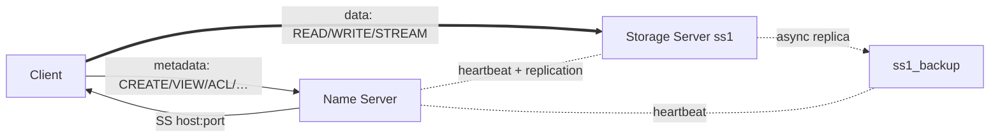

# Distributed File System

A distributed file system written from scratch in **C11** - a Name Server, replicated
Storage Servers, and interactive Clients over TCP - with sentence-level write locking,
access control, and storage-server **failover**. Metadata and coordination run through the
Name Server; bulk file data flows **directly** between client and storage server.



## Demo

A single client session against a running cluster (`NM + ss1`):

```text
> CREATE notes.txt
File Created Successfully!

> WRITE notes.txt 0
WRITE session ready for 'notes.txt' (sentence 0)
Enter '<word_index> <content>' lines (0-based indices). Type ETIRW to finish.
WRITE> 0 Distributed systems are fun.
WRITE> ETIRW
Write Successful!

> READ notes.txt
Distributed systems are fun.

> INFO notes.txt
--> File: notes.txt
--> Owner: alice
--> Size: 29 bytes
--> Access: alice (RW)

> ADDACCESS -R notes.txt bob      # bob can now READ, but not WRITE
Access granted successfully!
```

Fault tolerance, end to end (from the integration suite): with `ss1` and `ss1_backup`
running, a write is mirrored to the replica; when `ss1` is killed, the Name Server detects
the failure via missed heartbeats and repoints the file to `ss1_backup`, and reads keep
working - served transparently from the replica.

## Features

- **Files as sentences.** Content is edited at the word level within sentences; a sentence
  ends at `.`, `!`, or `?`. `WRITE` locks a single sentence so multiple users can edit the
  same file concurrently, just not the same sentence.
- **Direct data path.** The Name Server resolves *where* a file lives and steps aside; READ /
  WRITE / STREAM / UNDO go straight to the storage server.
- **Access control** with per-file read/write ACLs, plus a request→approve workflow.
- **Fault tolerance:** primary→replica replication, heartbeat failure detection, and automatic
  failover; data survives storage-server restarts (atomic on-disk writes).
- **The full command set:** `VIEW READ CREATE WRITE UNDO INFO DELETE STREAM LIST ADDACCESS
  REMACCESS EXEC`, folders (`CREATEFOLDER MOVE VIEWFOLDER`), and checkpoints
  (`CHECKPOINT REVERT LISTCHECKPOINTS`).

## Quick start

```sh
make                      # builds bin_nm, bin_ss, bin_client (-Wall -Wextra -Werror)

# Name Server
./bin_nm     --host 127.0.0.1 --port 5000

# Storage Server (owns its own storage directory)
./bin_ss     --nm-host 127.0.0.1 --nm-port 5000 --host 127.0.0.1 \
             --client-port 6001 --storage ./storage_ss1 --username ss1

# Client (interactive REPL - type `help`)
./bin_client --nm-host 127.0.0.1 --nm-port 5000 --username alice
```

For replication, start a second storage server named `ss1_backup`.

## Quality & tooling

- **42 integration tests** (`pytest` + `pexpect`) that spin up a **real** cluster - Name
  Server, storage servers, and clients on ephemeral ports - and exercise every operation
  plus the hard paths: concurrent writers contending on a sentence, replication, failover,
  heartbeat detection, persistence across restart, and mid-stream server death.

  ```sh
  make test          # uv run --with pytest --with pexpect python -m pytest tests/
  make check         # -Werror build + gcc -fanalyzer + pytest + ruff
  ```

- **Warning-clean under `-Wall -Wextra -Werror`**, plus `make analyze` (GCC static analyzer)
  and a `make tsan` ThreadSanitizer build.
- **Memory & I/O discipline:** abort-on-OOM allocation wrappers (`xmalloc`/`xrealloc`/…),
  bounded string operations (`snprintf`/`memcpy`, no unbounded `strcpy`/`strcat`), `EINTR`- and
  short-I/O-safe socket helpers, and `SIGPIPE` handled so a disconnecting peer can't crash a server.
- **Thread-safety:** the Name Server's shared index is guarded by a recursive mutex; storage
  servers use a worker pool with per-sentence locks.

## Architecture

Three executables share `src/common` (networking, the line protocol, logging, errors, ACL):

- **Name Server** - the metadata/coordination brain: an O(1) file index (hash map + LRU cache),
  the storage-server registry, an ACL cache, heartbeat monitoring, and replication/failover.
- **Storage Servers** - own file bytes on disk, serve data ops from an 8-thread worker pool,
  and write atomically (temp file + `rename`).
- **Client** - an interactive REPL that talks to the Name Server for metadata and directly to
  storage servers for data.

The wire protocol is one `\n`-terminated line per message: `TYPE|ID|USERNAME|ROLE|PAYLOAD`.
See **[docs/ARCHITECTURE.md](docs/ARCHITECTURE.md)** for the protocol reference, per-operation
sequence diagrams, the concurrency model, and the replication/failover design.

## Project layout

```
README.md              Makefile   pytest.ini   ruff.toml
docs/ARCHITECTURE.md   deep dive: protocol, data flow, concurrency, replication
include/{common,nm,ss,client}/   public headers
src/{common,nm,ss,client}/       Name Server, Storage Server, Client, shared code
tests/                 pytest + pexpect integration suite (conftest spins up a cluster)
```

## Limitations & roadmap

- **`EXEC` runs on the Name Server, unsandboxed** - the spec has it execute a file's contents
  as a shell script on the NM. It would run sandboxed (dropped privileges, timeout, resource
  limits) in production.
- **Index locking guards structure, not entry lifetime** - the recursive index mutex serializes
  the hash map/LRU, but an entry pointer handed to a caller is used after the lock is released, so
  a concurrent `DELETE` could still race with an in-flight reader (reference counting would close this).
- **Single Name Server** - its failure takes the system down; a consensus-replicated NM is future work.
- **~30 s failure detection** - a deliberate heartbeat threshold, tunable for faster detection.
