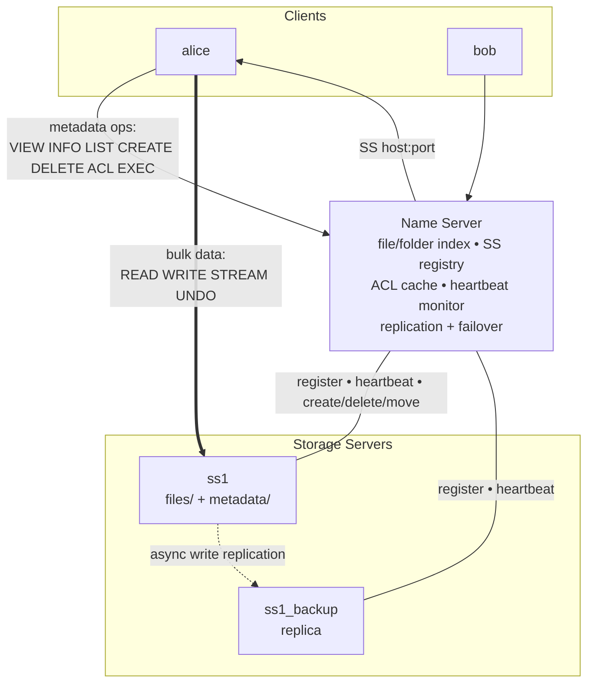
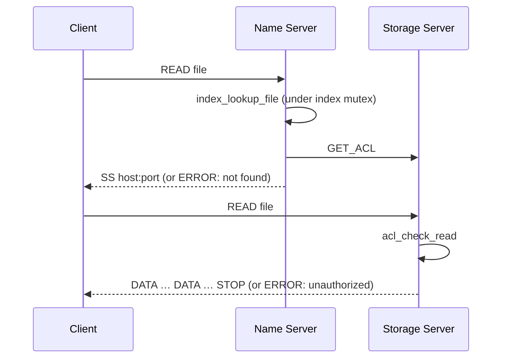
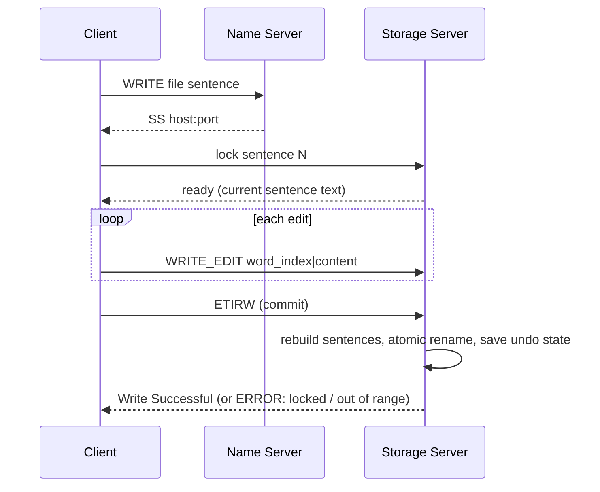
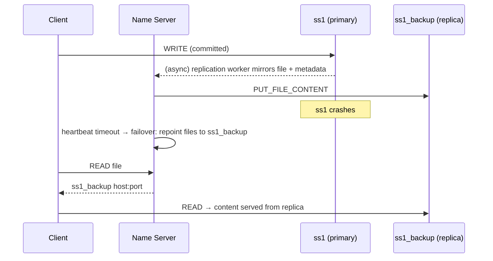

# Architecture

A distributed file system in C11: a **Name Server** (metadata/coordination), one or
more **Storage Servers** (file bytes on disk), and interactive **Clients**, all speaking
a small line-based protocol over TCP. The Name Server never carries bulk file data - it
answers a client with the storage server's address and steps aside, so file transfer
goes **directly** between client and storage server.

## Topology



The Name Server is a single well-known instance; storage servers and clients connect to
it and may join or leave at any time. Name-Server failure is out of scope (it is the
coordination point); storage-server failure is handled by replication + failover.

## Components

### Name Server (`src/nm/`)
The coordination brain. A **thread-per-connection** accept loop (`main.c`) handles each
client/SS socket on its own pthread. It owns:

- **File/folder index** (`index.c`) - a djb2 **hash map** for O(1) filename lookup plus a
  100-entry **LRU cache** of recent lookups, and a separate folder hash map. Guarded by a
  single recursive mutex (see [Concurrency](#concurrency)).
- **Registry** (`registry.c`) - the set of live storage servers and their addresses.
- **Access control** (`access_control.c`) - permission checks; the authoritative ACL lives
  on the storage server, so the NM fetches it and memoizes results in a 256-entry ring
  cache, invalidated on any ACL / MOVE / DELETE / access-approval change.
- **Heartbeat monitor** (`heartbeat_monitor.c`) - marks a storage server failed after it
  misses heartbeats, then fires a failover callback.
- **Replication / failover** (`replication.c`, `replication_worker.c`) - pairs each primary
  with a `<name>_backup` replica and asynchronously mirrors writes.

For bulk operations the NM only resolves *which* storage server holds the file and returns
its `host:port`; the client then talks to that SS directly.

### Storage Server (`src/ss/`)
Owns file bytes on disk. Registers with the NM, then serves client data operations from a
**fixed 8-thread worker pool** (`main.c`) so a long WRITE or STREAM session never blocks the
accept loop. Files and their metadata are lazy-loaded on demand. Key properties:

- **On-disk layout:** `storage_dir/files/<name>` for content, `storage_dir/metadata/<name>.meta`
  for owner, timestamps, ACL, sentence table, and pending access requests.
- **Atomic writes:** WRITE / UNDO / checkpoint flows write to a temp file and `rename()` into
  place, so a crash mid-write can't corrupt a file.
- **Per-sentence write locks** (`runtime_state.c`, `write_session.c`): a WRITE session locks a
  single sentence for the whole session; each sentence has a stable persisted ID so locks
  survive the re-indexing that happens when an edit adds or removes a sentence.

### Client (`src/client/`)
An interactive REPL. It sends metadata commands to the NM, and for READ/WRITE/STREAM/UNDO it
takes the `host:port` the NM returns and connects **directly to the storage server**.

## Wire protocol

One message = one `\n`-terminated line, fields `|`-separated (`src/common/protocol.h`):

```
TYPE|ID|USERNAME|ROLE|PAYLOAD
```

- Fixed-size `Message` struct; `MAX_LINE` is 2048, payload up to 1792 bytes.
- Parse/format with `proto_parse_line` / `proto_format_line`; transport with
  `recv_line` / `send_all` (`src/common/net.h`), which loop over `EINTR` and short I/O.
- **Errors** are carried in the payload as `ERROR_CODE|ERROR_MESSAGE`.
- Bulk responses (READ / STREAM / EXEC) are streamed as `DATA` messages and terminated by an
  explicit **`STOP`** marker so the client knows when output ends. Newlines inside content are
  escaped to `\x01` on the wire and restored by the client, keeping one-message-per-line intact.

Message types include: registration (`SS_REGISTER`, `CLIENT_REGISTER`), status (`HEARTBEAT`,
`ACK`, `ERROR`), file ops (`CREATE`, `DELETE`, `READ`, `WRITE*`, `STREAM`, `INFO`, `UNDO`,
`EXEC`), user ops (`VIEW`, `LIST`, `ADDACCESS`, `REMACCESS`), folders, and internal
NM↔SS commands (`GET_FILE`, `GET_ACL`, `GET_FILE_CONTENT`, `PUT_FILE_CONTENT`).

## Operation flows

**READ** (bulk, direct client↔SS):



**WRITE** (sentence-locked, direct client↔SS):



- Word indices are **0-based**; a sentence ends at `.`, `!`, or `?` (every delimiter counts,
  even mid-token like `e.g.`). Multiple edits in one session are a single undoable operation.
- A second writer on the same sentence gets `Sentence is locked by another writer`; independent
  sentences proceed in parallel.

**STREAM** is READ's cousin: the SS emits one word every 100 ms (`nanosleep`) until `STOP`. If
the SS dies mid-stream the client's `recv` fails and it reports `Connection closed unexpectedly`.

**EXEC** is the exception to the direct-data rule: the NM pulls the file content from the SS and
runs it as a shell script itself, streaming the output back to the client. See
[Limitations](#limitations-and-roadmap).

## Concurrency

Three pieces of shared state, three synchronization strategies:

| State | Where | Protection |
|-------|-------|-----------|
| File/folder index + LRU cache | NM | one **recursive** `pthread_mutex` (`g_index_mu`) taken by every index entry point |
| SS registry | NM | `pthread_mutex` (`g_registry_mu`) |
| ACL ring cache | NM | `pthread_mutex` (`g_acl_cache_mu`) |
| Per-sentence write locks | SS | in-memory lock table keyed by stable sentence ID |
| SS worker queue | SS | condition-variable work queue feeding 8 workers |

The index mutex is **recursive** because several entry points call `index_lookup_file` while
already holding the lock (e.g. `index_add_file` de-dupes, `index_move_file` and
`index_update_metadata` look up first). It is coarse-grained - one lock for the whole index -
chosen for correctness and simplicity over the per-bucket locking a higher-throughput system
would use.

## Replication and failover

- **Pairing:** a primary `ss1` is mirrored to a storage server named `ss1_backup`. Pairing is
  established whenever *either* side registers, so start order doesn't matter.
- **Write propagation:** after a write, a background worker pulls the file (and its `.meta`) from
  the primary via `GET_FILE_CONTENT` and pushes them to the replica via `PUT_FILE_CONTENT`. This
  is asynchronous - the client isn't blocked on replication.
- **Failure detection:** the heartbeat monitor marks a storage server failed after it misses
  heartbeats (a 15 s overdue threshold plus three missed 5 s checks, so ~30 s).
- **Failover:** on failure the NM repoints every file the dead primary owned to its replica; the
  replica already has both content and metadata, so subsequent READs succeed transparently.



## Failure handling

| Scenario | Behavior |
|----------|----------|
| File not found / bad index | `ERROR: NOT_FOUND` from the NM |
| Unauthorized read/write | ACL check on the SS → `ERROR: UNAUTHORIZED` |
| Sentence already being edited | `ERROR: Sentence is locked by another writer` |
| Invalid word/sentence index | `ERROR: out of range` |
| SS dies mid-STREAM | client prints `Connection closed unexpectedly` |
| Peer disconnects mid-send | `send()` returns `EPIPE` (SIGPIPE ignored) - server keeps running |
| Primary SS fails | heartbeat detection → failover to replica → reads continue |
| SS restarts | re-registers, re-scans its storage, re-indexes; data persisted on disk survives |
| Out-of-memory | abort-on-OOM allocation wrappers fail loudly instead of corrupting state |

## Design decisions

- **NM out of the data path.** The NM only resolves storage locations; bulk transfer is direct
  client↔SS. Keeps the coordinator light and lets storage scale horizontally.
- **Line-oriented text protocol.** Trivial to debug (readable with `nc`/Wireshark) and to parse
  with `recv_line`; the fixed `Message` struct bounds every field.
- **Lazy loading + atomic writes on the SS.** Content/metadata are read on demand; every mutation
  is temp-file-plus-`rename`, so the on-disk file is always a complete previous or new version.
- **ACL source of truth on the SS**, cached at the NM. Avoids stale permissions while keeping the
  common path fast.
- **Stable sentence IDs.** WRITE locks are keyed by a persisted sentence ID, not position, so an
  edit that inserts or splits a sentence doesn't invalidate another writer's lock.

## Limitations and roadmap

- **EXEC runs on the Name Server, unsandboxed.** By design (per the original spec) the file's
  contents are executed as a shell script on the NM. This is effectively remote code execution;
  in production it would run in a sandbox with dropped privileges, a timeout, and resource limits.
  *(Roadmap.)*
- **Index locking protects structure, not entry lifetime.** The recursive index mutex serializes
  the hash map / LRU, but a `FileEntry *` returned by a lookup is used by the caller after the
  lock is released, so a concurrent DELETE could race with an in-flight reader. Reference-counting
  or copy-out-under-lock would close this. *(Roadmap.)*
- **Failure detection is ~30 s.** Tunable via the heartbeat thresholds; lower values detect faster
  at the cost of false positives under load.
- **Single Name Server.** NM failure takes the system down; an HA NM (consensus-replicated
  metadata) is future work.
